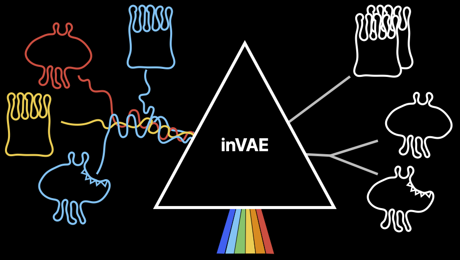

# inVAE

inVAE is a conditionally invariant variational autoencoder that identifies both spurious (distractors) and invariant features. 
It leverages domain variability to learn conditionally invariant representations. We show that inVAE captures biological variations in single-cell datasets obtained from diverse conditions and labs. 
inVAE incorporates biological covariates and mechanisms such as disease states, to learn an invariant data representation. This improves cell classification accuracy significantly. 

<p align="center">

<p\>

## Installation

1. PyPI only <br/> 
```pip install invae```<br/>

2. Development Version (latest version on github) <br/>
```git clone https://github.com/theislab/inVAE.git```<br/>
```pip install .```<br/>

## Example

[Integration of Human Lung Cell Atlas using both healthy and disease samples](https://github.com/theislab/inVAE/blob/master/notebooks/inVAE_LungAtlas.ipynb)

## Usage

1. Load the data: <br/>
```adata = sc.read(path/to/data)```<br/>
2. Optional - Split the data into train, val, test (in supervised case for training classifier as well)<br/>
3. Initialize the model, either Factorized or Non-Factorized:<br/>

```
from inVAE import FinVAE, NFinVAE`

inv_covar_keys = {
    'cont': [],
    'cat': ['cell_type', 'donor'] #set to the keys in the adata
}

spur_covar_keys = {
    'cont': [],
    'cat': ['site'] #set to the keys in the adata
}

model = FinVAE(
    adata = adata_train,
    layer = 'counts', # The layer where the raw counts are stored in adata (None for adata.X: default)
    inv_covar_keys = inv_covar_keys,
    spur_covar_keys = spur_covar_keys
)
```

or <br/>

``` 
model = NFinVAE(
    adata = adata_train,
    layer = 'counts', # The layer where the raw counts are stored in adata (None for adata.X: default)
    inv_covar_keys = inv_covar_keys,
    spur_covar_keys = spur_covar_keys
)
```

4. Train the generative model: <br/>
```model.train(n_epochs=500, lr_train=0.001, weight_decay=0.0001)```<br/>
5. Get the latent representation: <br/>
```latent = model.get_latent_representation(adata)```<br/>
6. Optional - Train the classifer (for cell types):

```
model.train_classifier(
    adata_val,
    batch_key = 'batch',
    label_key = 'cell_type',
)
```

7. Optional - Predict cell types: <br/>
```pred_test = model.predict(adata_test, dataset_type='test')```<br/>

8. Optional - Saving and loading model: <br/>
```
model.save('./checkpoints/path.pt')
model.load('./checkpoints/path.pt')
```<br/>

## Dependencies

* scanpy==1.9.3
* torch==2.0.1
* tensorboard==2.13.0
* anndata==0.8.0


## Citation

[H. Aliee, F. Kapl, S. Hediyeh-Zadeh, F. J. Theis, Conditionally Invariant Representation Learning for Disentangling Cellular Heterogeneity, 2023](https://arxiv.org/abs/2307.00558)

